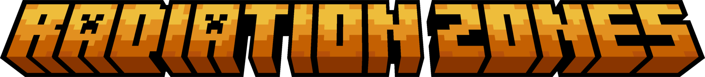

<div align="center">
  

  <p><strong>RadiationZones</strong> adds configurable radiation zones to Minecraft 1.21.1: players outside safe areas receive harmful effects unless protected by Lugol's iodine, with admin commands and warning boss bars available on <code>Paper</code>, <code>Fabric</code>, and <code>NeoForge</code>.</p>

  <p>
    <a href="https://github.com/FuzjaJadrowa/RadiationZones/actions/workflows/paper-build.yml"></a>
    <a href="https://github.com/FuzjaJadrowa/RadiationZones/actions/workflows/fabric-build.yml"></a>
    <a href="https://github.com/FuzjaJadrowa/RadiationZones/actions/workflows/neoforge-build.yml"></a>
  </p>
</div>

---

## Features
- Radiation zones defined per dimension.
- Admin commands to set and clear safe zones.
- Harmful effects applied to players outside safe zones.
- Lugol's iodine (custom effect + potion) as radiation protection.
- Configurable boss bar warning inside radiation zones.
- Configurable broadcast messages (zone entry / Lugol consumption).
- Shared gameplay concept across all targets: `paper/`, `fabric/`, `neoforge/`.

## Modules
- `paper` - Paper plugin.
- `fabric` - Fabric mod.
- `neoforge` - NeoForge mod.

## Commands (mod/plugin)
- `/radiation safe <radius>` - sets a safe zone in the current dimension around the command source position.
- `/radiation clear` - removes the safe zone in the current dimension.

Note: commands can be disabled in configuration (`enableCommands`).

## Configuration
- Fabric/NeoForge: `radiationzones-server.json` in the instance `config` directory.
- Paper: YAML configuration in the `paper` module (`config.yml`, `zones.yml`).

Configurable areas include:
- radiation check interval,
- radiation effect list,
- Lugol settings (color, duration, recipe),
- boss bar settings,
- broadcast toggles and message templates.

## Requirements
- Java 21
- Gradle Wrapper (included in the repository)

## Building
Build all modules:

```bash
./gradlew clean :paper:build :fabric:build :neoforge:build
```

Build individual modules:

```bash
./gradlew :paper:build
./gradlew :fabric:build
./gradlew :neoforge:build
```

Artifacts are generated in:
- `paper/build/libs/`
- `fabric/build/libs/`
- `neoforge/build/libs/`

## Contributing
- Report bugs and propose features via **Issues**.
- Submit code changes via **Pull Requests**.
- Before opening a PR, make sure builds pass for the modules you changed.

## Credits
- This project is a fork of **CraftserveRadiation**.
- The original project was released under the **Apache-2.0** license.
- The original developer is **Aleksander Jagiello**.

## License
This project is distributed under the **GPL-3.0** license (see `LICENSE`).
